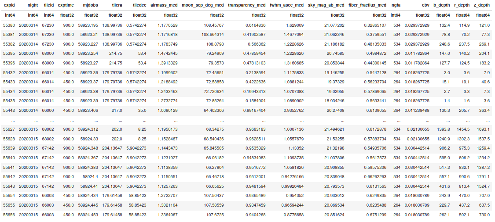

### Scripts to compute effective exposure times for DESI observations  

This repository contains scripts and files provided by D. Kirkby to compute the `DEPTH` for DESI observations

The computation is done in two steps.

**First Step**

Run `python desi_exposures_gfa.py sv0` (or `python desi_exposures_gfa.py minisv2`) to read the GFA and exposure information to build a summary table with the following columns 

`'expid'
'night'
'tileid'
'exptime'
'mjdobs'
'tilera'
'tiledec'
'airmass_min'
'airmass_med'
'airmass_max'
'moon_sep_deg_min'
'moon_sep_deg_med'
'moon_sep_deg_max'
'transparency_min'
'transparency_med'
'transparency_max'
'fwhm_asec_min'
'fwhm_asec_med'
'fwhm_asec_max'
'sky_mag_ab_min'
'sky_mag_ab_med'
'sky_mag_ab_max'
'fiber_fracflux_min'
'fiber_fracflux_med'
'fiber_fracflux_max'
'ngfa'
'ebv'`

The summary is saved to `desi_sv0_exposures_gfa.fits` (or `desi_minisv2_exposures_gfa.fits`).

**Second step** 

Checkout the spectrograph throughputs (`svn co https://desi.lbl.gov/svn/code/desimodel/tags/0.13.0/data/throughput thru13`) and run `python depth_calculation.py sv0` (or `python depth_calculation.py minisv2`).

This script takes the output generated in the first step together with the spectrograph throughputs and two different sky models (`dark_desimodel.fits` and `dark_eso.fits`) to estimate the `DEPTH` for each band. This is done by comparing the observed sky levels (EXPSKY is the mean sky in electrons detected with 100A smoothing ) against the expected model (IDSKY is the fiducial sky "dark zenith" with 100A smoothing ):

                     DEPTH = EXPTIME x (TRANSP/1.0)^2 x (FRACFLUX/0.56)^2 x (FIDSKY/EXPSKY)

where the TRANSP and FRACFLUX values come from the results of the first script. Finally, the `DEPTH` value is added as a new columns and the result is written to 
`desi_sv0_exposures_gfa_with_depth.fits` (or `desi_minisv2_exposures_gfa_with_depth.fits`)

This is how the final table looks like:

